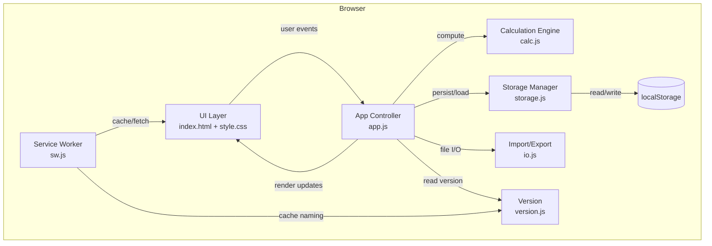
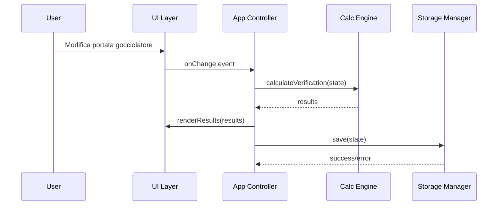

# Design Document — Irrigation Sizer

## Overview

A purely client-side static webapp (HTML + CSS + vanilla JavaScript) for managing drip irrigation of terrace pots. The application helps users configure pots with drippers, calculate water delivery (Verification mode) and required flow rates (Calibration mode), with all data persisted in `localStorage`. The app is mobile-first, Italian-language, dark-mode aware, installable as a PWA with offline support via service worker, and deployable to GitHub Pages with zero build steps.

### Key Design Decisions

| Decision | Rationale |
|----------|-----------|
| Vanilla JS (no framework) | Zero build step, direct GitHub Pages deploy, smallest payload |
| Single HTML file + separate CSS/JS | Simple structure, easy to maintain, relative paths work everywhere |
| localStorage as sole persistence | No backend, works offline, instant read/write |
| CSS custom properties for theming | Dark/light mode switch without JS class toggling per element |
| Event delegation | Efficient handling of dynamic pot/dripper lists |
| Module pattern (ES modules) | Clean separation of concerns while remaining browser-native |
| PWA with network-first SW | Immediate updates when online, offline fallback, auto-reload on SW update |
| Collapsible pot cards | Compact list view showing only names + results, expand for full config |
| Settings overlay panel | Separates configuration from main functionality per steering guidelines |
| Version module (version.js) | Single source of truth for app version, displayed in footer |

### High-Level Architecture Diagram



## Architecture

The application follows a layered architecture with clear separation between presentation, logic, and persistence:

### Layers

1. **UI Layer** (`index.html`, `style.css`) — DOM structure, styling, responsive layout, dark mode CSS variables.
2. **App Controller** (`app.js`) — Orchestrates user interactions, delegates to calculation and storage modules, manages application state in memory.
3. **Calculation Engine** (`calc.js`) — Pure functions for flow rate conversion, verification calculations, calibration calculations, weight-based distribution. No side effects.
4. **Storage Manager** (`storage.js`) — Serialization/deserialization to/from localStorage, validation of stored data, migration logic.
5. **Import/Export** (`io.js`) — JSON file generation for export, file reading and validation for import.
6. **Version** (`version.js`) — Exports APP_VERSION constant used in UI footer and SW cache naming.
7. **Service Worker** (`sw.js`) — Network-first fetch strategy with offline cache fallback. Auto-activates and triggers page reload on update.

### Data Flow



### Module Dependency Rules

- `calc.js` has **zero** dependencies (pure functions only).
- `storage.js` depends only on browser `localStorage` API.
- `io.js` depends only on browser File/Blob APIs.
- `version.js` has **zero** dependencies (exports a constant).
- `app.js` depends on `calc.js`, `storage.js`, `io.js`, `version.js`.
- `sw.js` is independent (runs in service worker context, uses cache naming convention matching version.js).
- No circular dependencies allowed.

## Components and Interfaces

### 1. Calculation Engine (`calc.js`)

Exports pure functions — the computational core of the application.

```javascript
/**
 * Converts a flow rate from any supported unit to l/min.
 * @param {number} value - The flow rate value
 * @param {'l/min'|'l/h'|'gocce/min'} unit - Source unit
 * @param {number} dropFactor - Drops per ml (default 20)
 * @returns {number} Flow rate in l/min
 */
export function toLitersPerMinute(value, unit, dropFactor = 20);

/**
 * Converts a flow rate from l/min to the target unit.
 * @param {number} lpm - Flow rate in l/min
 * @param {'l/min'|'l/h'|'gocce/min'} targetUnit - Target unit
 * @param {number} dropFactor - Drops per ml (default 20)
 * @returns {number} Flow rate in target unit
 */
export function fromLitersPerMinute(lpm, targetUnit, dropFactor = 20);

/**
 * Converts a flow rate from l/min to l/h.
 * @param {number} valueLpm - Value in l/min
 * @returns {number} Value in l/h
 */
export function toLitersPerHour(valueLpm);

/**
 * Calculates total liters delivered per pot (Verification mode).
 * @param {Dripper[]} drippers - Array of dripper configs
 * @param {number} timeMinutes - Activation time in minutes
 * @param {number} dropFactor - Drops per ml
 * @returns {number} Total liters (2 decimal precision)
 */
export function calculateVerification(drippers, timeMinutes, dropFactor);

/**
 * Calculates required flow rate per dripper (Calibration mode, uniform).
 * @param {number} desiredLiters - Target liters for the pot
 * @param {number} timeMinutes - Activation time in minutes
 * @param {number} dripperCount - Number of drippers
 * @returns {number} Required flow rate in l/min
 */
export function calculateCalibration(desiredLiters, timeMinutes, dripperCount);

/**
 * Calculates required flow rates with non-uniform weights.
 * @param {number} desiredLiters - Target liters for the pot
 * @param {number} timeMinutes - Activation time in minutes
 * @param {number[]} weights - Weight per dripper
 * @returns {number[]} Required flow rate per dripper in l/min
 */
export function calculateWeightedCalibration(desiredLiters, timeMinutes, weights);

/**
 * Calculates suggested alternative time when flow is out of range.
 * Uses l/h boundaries (1 l/h = 1/60 l/min, 8 l/h = 8/60 l/min internally).
 * Rounds to nearest integer minute, capped at 60.
 * @param {number} desiredLiters - Target liters
 * @param {number} dripperCount - Number of drippers
 * @param {'min'|'max'} bound - Which bound was exceeded
 * @returns {number} Suggested time in minutes (integer, max 60)
 */
export function suggestAlternativeTime(desiredLiters, dripperCount, bound);

/**
 * Validates a flow rate value against the 1-8 l/h range.
 * @param {number} valueLph - Value in l/h
 * @returns {{valid: boolean, message?: string}}
 */
export function validateFlowRate(valueLph);
```

### 2. Storage Manager (`storage.js`)

Handles all localStorage interactions with validation.

```javascript
const STORAGE_KEY = 'irrigationSizing_config';

/**
 * Saves the full application state to localStorage.
 * @param {AppState} state - Complete application state
 * @returns {{success: boolean, error?: string}}
 */
export function saveState(state);

/**
 * Loads application state from localStorage.
 * @returns {{success: boolean, data?: AppState, error?: string}}
 */
export function loadState();

/**
 * Resets localStorage to empty state.
 */
export function resetState();

/**
 * Checks if localStorage is available and has quota.
 * @returns {boolean}
 */
export function isStorageAvailable();
```

### 3. Import/Export (`io.js`)

Handles JSON file operations.

```javascript
/**
 * Exports current configuration as a downloadable JSON file.
 * @param {AppState} state - Current app state
 * @returns {void} - Triggers file download
 */
export function exportConfig(state);

/**
 * Reads and validates an imported JSON file.
 * @param {File} file - Selected file from input
 * @returns {Promise<{success: boolean, data?: AppState, error?: string}>}
 */
export function importConfig(file);

/**
 * Validates a parsed config object against the expected schema.
 * @param {object} obj - Parsed JSON object
 * @returns {{valid: boolean, errors: string[]}}
 */
export function validateConfig(obj);
```

### 4. App Controller (`app.js`)

Orchestrates state management, event handling, and rendering. Maintains in-memory state and syncs to localStorage.

```javascript
/**
 * Initializes the application: loads state, sets up event listeners, renders UI.
 */
export function init();

// Internal state management
let state = { 
  pots: [], 
  dropFactor: 20, 
  mode: 'verifica', 
  timeMinutes: 0, 
  theme: 'light',
  desiredLiters: {}
};

// Event handlers (bound via event delegation on container)
function handleAddPot();
function handleRemovePot(potId);
function handleDuplicatePot(potId);
function handleToggleCollapse(potId);
function handleDripperCountChange(potId, newCount);
function handleDripperChange(potId, dripperId, field, value);
function handleDesiredLitersChange(potId, value);
function handleWeightChange(potId, index, value);
function handleNonUniformToggle(potId, checked);
function handleModeSwitch(mode);
function handleTimeChange(value);
function handleThemeToggle();
function handleExport();
function handleImport(file);
function handleReset();
function formatFlowForDisplay(valueLpm, displayUnit, dropFactor);
```

### 5. UI Components (HTML structure)

```
index.html
├── <header> — App title ("Irrigation Sizer"), mode toggle (tabs), theme toggle (🌓), settings toggle (⚙️)
├── <main>
│   ├── <section#slider> — Tempo di accensione (range slider 0-60 step 1 + label) [STICKY]
│   ├── <section#pot-list> — Dynamic pot cards (collapsible)
│   │   └── <article.pot-card[.collapsed]> (repeated)
│   │       ├── div.pot-card__header (clickable: chevron + name + summary + actions)
│   │       └── div.pot-card__body (hidden when collapsed)
│   │           ├── Toggle group (uniform/differentiated)
│   │           ├── Dripper fields / count input
│   │           ├── [Calibration] Desired liters + weights + inline unit selectors
│   │           └── Result display
│   └── <section#totals> — Total water display (visible in BOTH modes)
├── <div#settings-panel> — Overlay panel (drop factor, export, import, reset)
└── <footer> — App name + version (v1.6.7)
```

## Data Models

### AppState (root state object)

```typescript
interface AppState {
  pots: Pot[];
  dropFactor: number;         // 1–100, default 20 (gocce per ml)
  mode: 'verifica' | 'taratura';
  timeMinutes: number;        // 0–60, step 1 (integer)
  theme: 'light' | 'dark';   // resolved preference
  // Calibration-specific data preserved across mode switches
  desiredLiters: Record<string, number>;  // potId -> desired liters
}
```

### Pot

```typescript
interface Pot {
  id: string;                 // UUID or auto-increment string
  name: string;               // max 40 chars
  drippers: Dripper[];        // 1–20 drippers
  uniformFlow: boolean;       // true = same flow for all
  uniformValue: number | null;  // common flow value (in display unit)
  uniformUnit: FlowUnit;     // unit for uniform mode
  nonUniformWeights: boolean; // calibration: weighted distribution
  weights: number[];          // weight per dripper (1–10, step 0.1)
  collapsed: boolean;          // true = card is collapsed
  resultDisplayUnit: FlowUnit; // unit for calibration result display (default = uniformUnit)
}
```

### Dripper

```typescript
interface Dripper {
  id: string;
  flowRate: number | null;    // value in the selected unit (null = not set)
  unit: FlowUnit;             // display unit for this dripper
  resultDisplayUnit?: FlowUnit; // per-dripper result display unit (differentiated mode)
}

type FlowUnit = 'l/min' | 'l/h' | 'gocce/min';
```

### Conversion Formulas

| From | To l/min | Formula |
|------|----------|---------|
| l/min | l/min | identity |
| l/h | l/min | `value / 60` |
| gocce/min | l/min | `value / (dropFactor * 1000)` |

Inverse:

| From l/min | To | Formula |
|------------|-----|---------|
| l/min | l/min | identity |
| l/min | l/h | `value * 60` |
| l/min | gocce/min | `value * dropFactor * 1000` |

### localStorage Schema (JSON)

```json
{
  "version": 1,
  "dropFactor": 20,
  "timeMinutes": 15,
  "mode": "verifica",
  "theme": "dark",
  "desiredLiters": {},
  "pots": [
    {
      "id": "pot-1",
      "name": "Geranio",
      "uniformFlow": true,
      "uniformValue": 2.5,
      "uniformUnit": "l/min",
      "nonUniformWeights": false,
      "weights": [1, 1, 1],
      "collapsed": false,
      "resultDisplayUnit": "l/h",
      "drippers": [
        { "id": "d-1", "flowRate": 2.5, "unit": "l/min" },
        { "id": "d-2", "flowRate": 2.5, "unit": "l/min" },
        { "id": "d-3", "flowRate": 2.5, "unit": "l/min" }
      ]
    }
  ]
}
```

The `version` field enables future schema migrations if the data format evolves.

## Correctness Properties

*A property is a characteristic or behavior that should hold true across all valid executions of a system — essentially, a formal statement about what the system should do. Properties serve as the bridge between human-readable specifications and machine-verifiable correctness guarantees.*

### Property 1: Persistence Round-Trip

*For any* valid `AppState` (containing any combination of pots with drippers, flow rates, units, drop factor, time, theme, and desired liters), serializing the state to localStorage via `saveState()` and then deserializing it via `loadState()` SHALL produce an object deeply equal to the original state.

**Validates: Requirements 7.1, 7.3, 4.4, 6.5, 17.3**

### Property 2: Export/Import Round-Trip

*For any* valid `AppState`, exporting to JSON and then importing that JSON SHALL produce a state deeply equal to the original, preserving all pot names, dripper counts, flow rates, units, and drop factor.

**Validates: Requirements 8.1, 8.3**

### Property 3: Unit Conversion Round-Trip

*For any* numeric flow rate value `v` within the valid range and *for any* unit in {l/h, gocce/min}, converting `v` from that unit to l/min via `toLitersPerMinute(v, unit, dropFactor)` and then back via `fromLitersPerMinute(result, unit, dropFactor)` SHALL produce a value equal to `v` (within floating-point tolerance of 1e-10).

**Validates: Requirements 3.8, 3.9, 10.3**

### Property 4: Verification Calculation Correctness

*For any* set of drippers with valid flow rates (each with arbitrary unit) and *for any* positive `timeMinutes` in (0, 60], the verification result for a pot SHALL equal the sum of each dripper's flow rate converted to l/min, multiplied by `timeMinutes`, rounded to 2 decimal places. Furthermore, the total across all pots SHALL equal the sum of individual pot results.

**Validates: Requirements 9.2, 9.3, 9.4**

### Property 5: Calibration Calculation Correctness

*For any* positive `desiredLiters`, *for any* positive `timeMinutes`, and *for any* `dripperCount` ≥ 1, the calibration result SHALL equal `desiredLiters / timeMinutes / dripperCount`. Equivalently: `result * dripperCount * timeMinutes == desiredLiters` (within floating-point tolerance).

**Validates: Requirements 10.2**

### Property 6: Weighted Calibration Preserves Total Volume

*For any* set of positive weights, *for any* positive `desiredLiters`, and *for any* positive `timeMinutes`, the weighted calibration SHALL produce per-dripper flow rates such that the sum of all (flow_i × timeMinutes) equals `desiredLiters` (within floating-point tolerance). Each flow_i SHALL equal `(weight_i / sum_of_weights) * (desiredLiters / timeMinutes)`.

**Validates: Requirements 11.2**

### Property 7: Alternative Time Suggestion Correctness

*For any* `desiredLiters` > 0 and `dripperCount` ≥ 1:
- When the calculated flow exceeds 8 l/h, the suggested alternative time SHALL equal `desiredLiters / (dripperCount * (8/60))` rounded to the nearest integer minute and capped at 60, which when used as input produces a flow rate at or near the 8 l/h boundary.
- When the calculated flow is below 1 l/h, the suggested alternative time SHALL equal `desiredLiters / (dripperCount * (1/60))` rounded to the nearest integer minute and capped at 60, which when used as input produces a flow rate at or near the 1 l/h boundary.

**Validates: Requirements 10.4, 10.5**

### Property 8: Flow Rate Validation Boundary

*For any* numeric value `v` and *for any* unit and *for any* valid `dropFactor`, `validateFlowRate(toLitersPerHour(toLitersPerMinute(v, unit, dropFactor)))` SHALL return `valid: true` if and only if the l/h equivalent is in the closed interval [1, 8].

**Validates: Requirements 5.1**

### Property 9: Mode Switch State Invariant

*For any* `AppState` in mode `M1`, switching to mode `M2` and then switching back to `M1` SHALL preserve: all pot configurations (names, drippers, flow rates, units), the `timeMinutes` value, and all `desiredLiters` values. Only the `mode` field changes.

**Validates: Requirements 12.1, 12.3**

### Property 10: Uniform-to-Differentiated Transition

*For any* pot with `uniformFlow = true` and a uniform value `v` with unit `u`, and *for any* number of drippers (1–20), transitioning to differentiated mode SHALL result in every dripper having `flowRate = v` and `unit = u`.

**Validates: Requirements 3.3**

### Property 11: Differentiated-to-Uniform Transition

*For any* pot with differentiated drippers: if all drippers share the same value `v` and unit `u`, switching to uniform mode SHALL set `uniformValue = v` and `uniformUnit = u`. If drippers have differing values or units, switching to uniform SHALL set the uniform value to the first dripper's value and unit.

**Validates: Requirements 3.4, 3.5**

### Property 12: Pot Duplication Preserves Configuration

*For any* pot with name `N`, `k` drippers (each with flow rate, unit), uniform/differentiated setting, and weights, duplicating the pot SHALL produce a new pot where: all dripper configurations are identical, the name follows the pattern `N (m)` where `m` is the next available suffix, and the original pot remains unchanged.

**Validates: Requirements 6.4**

### Property 13: Default Name Generation

*For any* set of existing pot names that includes some default names in the format "Vaso N", adding a new pot without a specified name SHALL assign "Vaso M" where M is the smallest positive integer not already used as a default name among the current pots.

**Validates: Requirements 2.2**

### Property 14: Corrupt Data Resilience

*For any* arbitrary string stored in the localStorage key (including random bytes, truncated JSON, JSON with wrong schema, or empty string), `loadState()` SHALL return a failure result without throwing, and the application SHALL present an empty pot list without modifying the stored data.

**Validates: Requirements 1.3, 7.4**

### Property 15: Dripper Removal Preserves Siblings

*For any* pot with `n > 1` drippers, removing dripper at index `i` SHALL result in a pot with `n - 1` drippers where all drippers except the one at index `i` retain their original flow rate, unit, and relative order.

**Validates: Requirements 6.2**

## Error Handling

### Error Categories and Strategies

| Category | Trigger | User Feedback | System Behavior |
|----------|---------|---------------|-----------------|
| Invalid flow rate input | Non-numeric, empty, or out-of-range value (outside 1–8 l/h) | Red border + warning message (IT) | Exclude from calculations, don't block |
| Invalid dripper count | < 1, > 20, or non-integer | Inline error, block confirmation | Prevent pot creation until corrected |
| Invalid drop factor | < 1, > 100, non-numeric, or empty | Inline error | Keep last valid value for calculations |
| Invalid weight | ≤ 0 or non-numeric | Inline error, block pot calculations | No results for that pot until fixed |
| Corrupt localStorage | Failed parse, wrong schema | Toast/banner notification (non-blocking) | Start with empty state, don't overwrite |
| localStorage unavailable | API throws or quota exceeded | Informational toast | Continue without persistence |
| Invalid import file | Not JSON, missing fields, wrong types | Modal/inline error with problem description | Preserve current configuration |
| Division by zero (time=0) | Slider at 0 | Message: "Impostare tempo > 0" | Hide all results, disable calculations |

### Validation Timing

- **Flow rate validation**: within 500ms of input change (debounced)
- **Calculation updates**: within 200ms of any input change (immediate for slider)
- **localStorage save**: within 1000ms of state change (debounced)

### Graceful Degradation

The application follows a "never crash, never block" philosophy:
1. Invalid individual inputs are flagged but don't prevent other operations
2. Storage failures don't prevent usage — the app works in-memory for the session
3. Import failures preserve the current state entirely
4. All error messages are in Italian and non-technical

## Testing Strategy

### Property-Based Testing (PBT)

**Library**: [fast-check](https://github.com/dubzzz/fast-check) (JavaScript PBT library, well-maintained, works in browser and Node.js)

**Configuration**:
- Minimum 100 iterations per property test
- Each test tagged with: `// Feature: irrigation-sizing, Property N: <title>`

**Scope**: The 15 correctness properties defined above will each be implemented as a property-based test targeting the pure function layer (`calc.js`, `storage.js`, `io.js`).

**Generators needed**:
- `arbFlowRate`: number in range [0.5, 10] (to test both valid and invalid values)
- `arbUnit`: one of 'l/min', 'l/h', 'gocce/min'
- `arbDropFactor`: integer in [1, 100]
- `arbTimeMinutes`: integer in [1, 60]
- `arbDripper`: `{ flowRate: arbFlowRate, unit: arbUnit }`
- `arbPot`: `{ name: string(1-40), drippers: array(1-20, arbDripper), uniformFlow: boolean, ... }`
- `arbAppState`: full state with 0–50 pots
- `arbCorruptData`: arbitrary string / truncated JSON / wrong-schema object

### Unit Tests (Example-Based)

Unit tests cover specific examples, edge cases, and UI interactions not suitable for PBT:

- **UI rendering**: Correct elements shown per mode (9.1, 10.1)
- **Edge cases**: Time = 0 behavior, single dripper removal blocked, empty localStorage
- **User interactions**: Add pot form, confirmation dialogs, mode switch control
- **Localization**: All visible text in Italian

### Integration Tests

- **End-to-end flow**: Add pot → configure drippers → switch modes → verify results
- **Import/export**: Full file round-trip via actual File API
- **Offline behavior**: Service worker / cache verification
- **Responsive layout**: Visual regression at 320px, 375px, 428px, 768px breakpoints

### Test Runner

**Vitest** — fast, ESM-native, works with vanilla JS modules, integrates with fast-check. Run with `vitest --run` for CI (no watch mode).

```
/tests
  /unit
    calc.test.js        # Pure calculation tests
    storage.test.js     # localStorage interaction tests
    io.test.js          # Import/export validation tests
  /property
    calc.property.js    # Properties 3-8
    state.property.js   # Properties 1, 2, 9-15
  /integration
    app.integration.js  # Full flow tests
```
